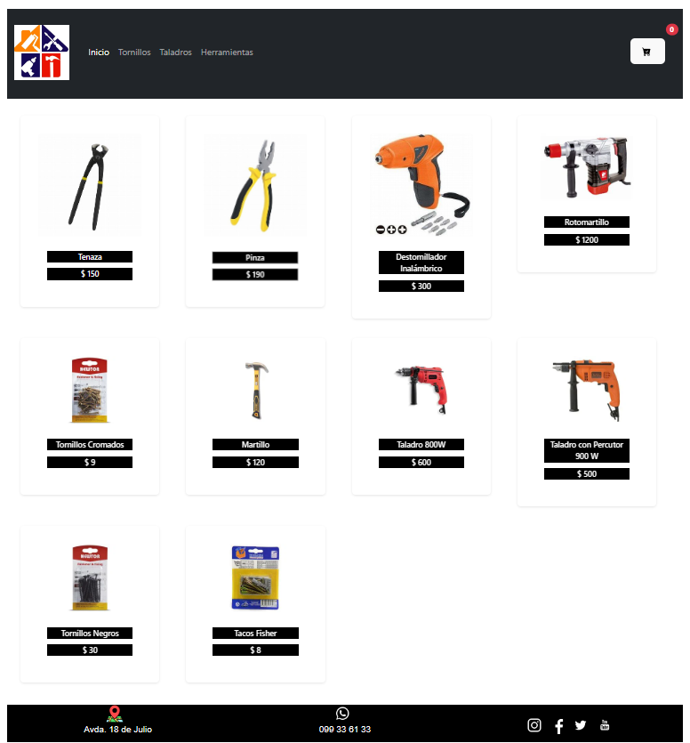

# Ferretería Avenida E-Commerce

¡Bienvenido a la Ferretería Avenida E-Commerce! Esta aplicación de comercio electrónico para ferreterías ha sido desarrollada utilizando React, Bootstrap, CSS y Firebase.

## Características Principales

- **Catálogo de Productos:** Explora nuestro extenso catálogo de productos de ferretería.
- **Carrito de Compras:** Agrega y gestiona productos en tu carrito de compras.
- **Autenticación de Usuarios:** Crea una cuenta para disfrutar de funcionalidades personalizadas y seguras.
- **Firebase Integration:** Utilizamos Firebase para almacenar datos en tiempo real y gestionar la autenticación de usuarios.

## Capturas de Pantalla



## Instalación

1. Clona el repositorio:

   ```bash
   git clone https://github.com/Aleromeropedrin/PreEntrega2AleRomero

